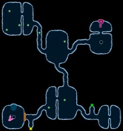
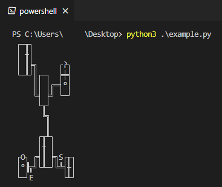

# libPCSX2
A tool to allow for scripting games on PCSX2 using the Windows API through Python.

## Example
In this example, it reads from the PS2's memory in order to obtain and print the minimap of "Dark Cloud" to the console.

<p align="center">
  
  
</p>

```python
from libpcsx2 import PCSX2

def get_tile_ascii(id_: int, rotation: int) -> str:
    """Return the ASCII equivalent to the tile"""

    TILES_TO_ASCII = {
        0xFFFFFFFF: [" ", " ", " ", " "],
        0x00000000: ["║", "═", "║", "═"],
        0x00000001: ["╔", "╗", "╝", "╚"],
        0x00000002: ["╬", "╬", "╬", "╬"],
        0x00000003: ["╦", "╣", "╩", "╠"],
        0x00000004: ["╥", "╡", "╨", "╞"],
        0x00000005: ["─", "│", "─", "│"],
        0x00000006: ["│", "─", "│", "─"],
        0x00000007: ["─", "│", "─", "│"],
        0x00000008: ["│", "─", "│", "─"],
        0x00000009: ["╨", "╞", "╥", "╡"],
        0x0000000A: ["╞", "╥", "╡", "╨"],
        0x0000000B: ["╥", "╡", "╨", "╞"],
        0x0000000C: ["╡", "╨", "╞", "╥"],
        0x0000000D: ["┌", "┐", "┘", "└"],
        0x0000000E: ["┐", "┘", "└", "┌"],
        0x0000000F: ["┘", "└", "┌", "┐"],
        0x00000010: ["└", "┌", "┐", "┘"],
        0x00000011: [" ", " ", " ", " "],
        0x00000012: ["╥", "╡", "╨", "╞"],
        0x00000013: ["╡", "╨", "╞", "╥"],
        0x00000014: ["╨", "╞", "╥", "╡"],
        0x00000015: ["╞", "╥", "╡", "╨"],
        0x00000016: ["╫", "╪", "╫", "╪"],
        0x00000017: ["╪", "╫", "╪", "╫"],
        0x00000018: ["╫", "╪", "╫", "╪"],
        0x00000019: ["╪", "╫", "╪", "╫"],
        0x0000001A: ["║", "═", "║", "═"],
        0x0000001B: ["═", "║", "═", "║"],
        0x0000001C: ["║", "═", "║", "═"],
        0x0000001D: ["═", "║", "═", "║"],
        0x0000001E: ["S", "S", "S", "S"],
        0x0000001F: ["E", "E", "E", "E"],
        0x00000020: ["O", "O", "O", "O"],
        0x00000021: ["O", "O", "O", "O"],
        0x00000022: ["O", "O", "O", "O"],
        0x00000023: ["O", "O", "O", "O"],
        0x00000024: ["▀", "▐", "▄", "▌"],
        0x00000025: ["▐", "▄", "▌", "▀"],
        0x00000026: ["▄", "▌", "▀", "▐"],
        0x00000027: ["▌", "▀", "▐", "▄"],
        0x00000028: ["?", "?", "?", "?"],
        0x00000029: ["?", "?", "?", "?"],
        0x0000002A: ["?", "?", "?", "?"],
        0x0000002B: ["?", "?", "?", "?"],
        0x0000002C: ["║", "═", "║", "═"],
        0x0000002D: ["°", "°", "°", "°"],
        0x0000002E: ["°", "°", "°", "°"],
    }

    if id_ not in TILES_TO_ASCII or rotation >= 4:
        raise ValueError(f"Invalid Tile Data ({id_}, {rotation})")

    return TILES_TO_ASCII[id_][rotation]

def main() -> None:
    """An example script to showcase libPCSX2's capabilities"""

    DUNGEON_MAP_ADDRESS = 0x01DCE830

    pcsx2 = PCSX2("Dark Cloud")

    for y in range(15):
        for x in range(15):
            idx = (20*y + x) << 4 # Each tile is a struct of size 0x10 in a 20x20 array

            print(
                get_tile_ascii(
                    pcsx2.read_u32(DUNGEON_MAP_ADDRESS + idx),
                    pcsx2.read_u32(DUNGEON_MAP_ADDRESS + idx + 4),
                ),
                end=""
            )
        print()

if __name__ == "__main__":
    main()
```
